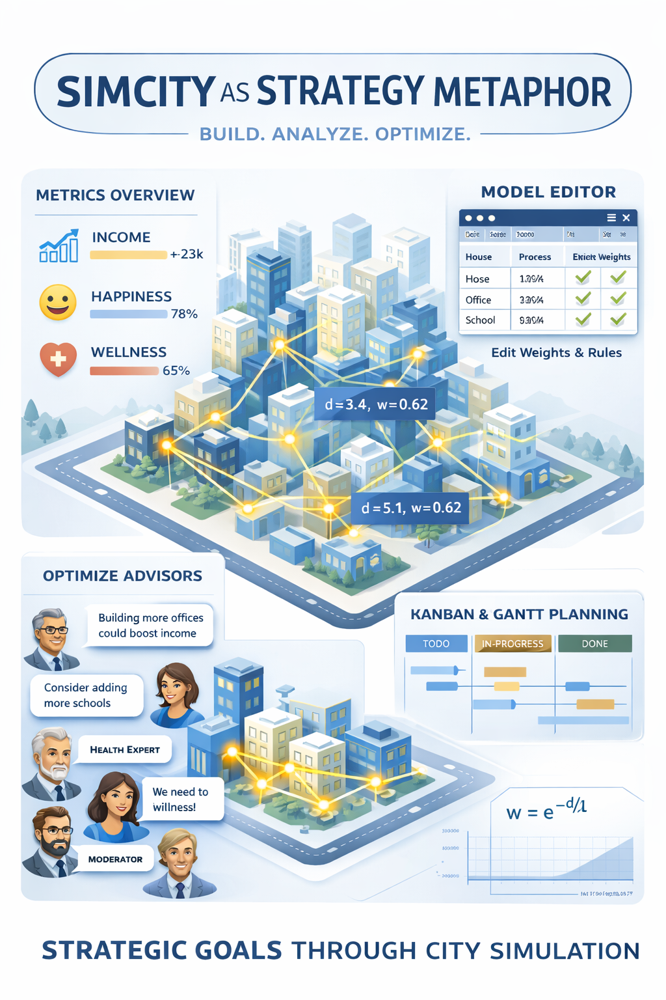

# CityLife — Isometric Life‑Planning City Builder

CityLife is an isometric “city builder” that doubles as a **life planning simulator**.  
Instead of optimizing zoning and taxes, you place *commitments* and *activities* as buildings, connect them by roads, and watch how your **Income**, **Happiness**, and **Wellness** evolve as a coupled network over time.



The intent is to feel like a calm, technical instrument panel: a spatial model of your life where you can iterate quickly, inspect causality, and tune assumptions.

---

## Vision

Most planning tools treat tasks as flat lists. CityLife treats them as a **spatial system**:

- Buildings are *nodes* (tasks, projects, habits, routines).
- Roads are *dependencies/commute/effort pathways* that enable activities to influence one another.
- The shortest road distance between nodes defines how strongly they interact.
- The player’s goal is to maintain sustainable **life balance** rather than maximize a single metric.

This supports two complementary modes:

1. **Spatial planning** (isometric view): place/move things to change proximity and connectivity.
2. **Systems analysis** (relationship graph): inspect influence pathways and key bottlenecks.

---

## Core Concept: Buildings as Life Nodes

Buildings map to categories (these are conceptual defaults; the model is configurable):

- **Housing** (e.g., House): availability of time/people/energy (demand + stability)
- **Work — Current Income** (e.g., Factory): produces income now, can create strain if too close to housing/leisure
- **Work — Capacity / Future Income** (e.g., Office): improves sustainment, planning, future capacity; depends on housing access
- **Health** (e.g., Hospital): increases wellness; supports work sustainability
- **Leisure** (e.g., Park, Mall): increases happiness; supports retention/sustainability of work
- **Development** (e.g., School): improves long-term capacity and optional cross‑effects

A building must be **connected to the road network** to be active (usable).

---

## What’s Implemented Today

### Current features (completed)

- [x] Isometric renderer (Canvas 2D) with depth sorting and a stylized background
- [x] Tool system: place roads and buildings, move buildings, bulldoze roads/buildings
- [x] Road adjacency rule: buildings must touch a road tile to become **Active**
- [x] Road-distance pathfinding: shortest path on roads (BFS) for relationships/influence
- [x] HUD showing Income / Happiness / Wellness and recent history (sparklines)
- [x] Relationship graph modal (Cytoscape.js) to visualize building relationships
- [x] Example starter city loaded at game start
- [x] Runs locally with a simple HTTP server (no build step)

### In-progress / needing polish

- [ ] Relationship graph aesthetics (aim: Obsidian-like refinement)
- [ ] Road markings/intersection visuals fully consistent with connectivity
- [ ] Robust error boundary around renderer loop (prevent silent blank-screen failures)

---

## Roadmap (Proposed)

### Near-term (core UX + configurability)
- [ ] **Spreadsheet-based “Model Editor” button**: open an editable table of weights and coefficients (see below)
- [ ] Relationship graph refinement:
  - [ ] smaller nodes, subtle depth, thin curved edges, hover tooltips
  - [ ] satisfying “jiggle” physics response on drag
- [ ] Save/Load:
  - [ ] localStorage autosave
  - [ ] JSON export/import

### Mid-term (planning views)
- [ ] **Kanban board** generated from buildings/tasks:
  - [ ] columns by status (Backlog / Active / Blocked / Done)
  - [ ] edit status and notes; sync back to buildings
- [ ] **Gantt chart** view:
  - [ ] edit start/end dates, milestones, dependencies
  - [ ] propagate schedule metadata back to buildings


### Advisors (LLM Agent Support)
- [ ] Omnipresent advisor panel (chat-style) with context of the city-as-life metaphor
- [ ] Multiple personas (initial default set):
  - [ ] Income advisor (focus: sustainability of work and runway)
  - [ ] Happiness advisor (focus: joy, motivation, social/leisure balance)
  - [ ] Wellness advisor (focus: health, recovery, long-term resilience)
  - [ ] Moderator advisor (balances tradeoffs, resolves conflicts, proposes experiments)
- [ ] Advisor suggestions for:
  - [ ] improving the city/model representation (weights, placement, connectivity)
  - [ ] real-world actions (next steps, scheduling, de-scoping, recovery time)
  - [ ] “what-if” scenarios (simulate changes and explain likely outcomes)
- [ ] Explainability: advisors cite the graph paths and terms contributing to advice
- [ ] Privacy-first: local-only mode and/or explicit user consent before sending data externally


#### Sample prompts (content + persona)

The advisor panel can support both “city edits” (model changes) and “real-world planning” (behavioral suggestions). Below are example prompts that establish persona and request structured output.

**1) Moderator (balanced, experimental)**
- “Review my current city as a life model. Identify the top three bottlenecks reducing sustainability. Propose two small, testable changes and explain the expected effect on Income, Happiness, and Wellness.”
- “Given the current graph, which relationships are most sensitive to distance? Suggest a move plan that improves balance with minimal disruption.”
- “Propose a weekly experiment: what to adjust in the city and what to try in real life. Define success criteria.”

**2) Income advisor (runway, sustainability)**
- “Prioritize stable income. Where is my work capacity fragile due to poor housing access or missing support nodes? Suggest changes in the city and a concrete real-world action list.”
- “Identify which work nodes are underperforming due to road distance to housing. Provide a ranked list with distance and estimated lost income.”

**3) Happiness advisor (motivation, retention)**
- “Optimize for motivation and enjoyment without collapsing income. Where are leisure and social recovery nodes too distant from housing? Recommend placement changes and a weekly plan.”
- “Detect patterns where factories or workload are suppressing happiness near housing. Suggest mitigations.”

**4) Wellness advisor (recovery, resilience)**
- “Treat wellness as the constraint. Where is health coverage weak (distance from housing)? Suggest the smallest city edits and real-life habits to raise wellness without losing runway.”
- “Identify any ‘burnout risk’ clusters (high work influence, low wellness support). Recommend a rebalancing.”

**5) Model calibration (meta)**
- “The simulation feels too punitive/too generous. Suggest adjustments to \(\lambda\), \(d_{\max}\), and key coefficients to match a realistic week of effort.”

#### Prompt patterns (recommended structure)

To keep advice actionable, prefer prompts that request:

- **A diagnosis section** (what is happening and why)
- **A small set of changes** (2–5 edits)
- **An explanation** (which edges/paths and coefficients drove the recommendation)
- **A rollout plan** (step-by-step, with expected metric deltas)
- **Confidence / assumptions** (what the advisor is assuming about the user’s life)

Example:
- “Return a JSON block with: `diagnosis`, `recommendedCityEdits`, `realWorldActions`, `expectedMetricDeltas`, `assumptions`.”

---

### Summarizing game state for LLMs (best practices)

LLMs perform best when the simulation state is summarized in a **compact, structured, and stable** format. The goal is to convey enough information for high-quality reasoning without exceeding token budgets.

#### 1) Provide a layered summary (coarse → detailed)

**Layer 0: Global**
- Grid size
- Global parameters: \(\lambda\), \(d_{\max}\), \(\theta\)
- Current metrics: Income/Happiness/Wellness (+ short history or deltas)

**Layer 1: Nodes**
- For each building: `id`, `category`, `active`, `pos`, `role` (optional: title/status/dates)
- Optionally: top contributions per node (local base vector)

**Layer 2: Connectivity**
- Road network stats: number of road tiles, connected components, largest component size
- For each active building: nearest road tile(s) and whether it connects to the main component

**Layer 3: Relationships (sparse)**
- Provide only meaningful edges:
  - edges above threshold, or
  - top N strongest edges per node
- Include for each edge: `source`, `target`, `distance`, `weight`, and optionally `dominantEffects` (which metric dimensions matter most)

#### 2) Use stable identifiers and explicit units

- Use stable building ids (do not renumber on each run).
- Distances should be in road steps (integer BFS length).
- Weights should be floating-point with fixed precision (e.g., 2–3 decimals).

#### 3) Prefer sparse “top edges” over full adjacency

For large cities, a full edge list becomes noisy. A common strategy:

- Keep top \(N\) edges per node by weight (e.g., \(N=4\))
- Deduplicate edges by id
- Report any nodes that have *no* edges (isolated) explicitly

#### 4) Provide “attribution” for metric changes

Instead of only reporting the final metrics, provide a short attribution:

- top positive contributors to each metric
- top negative contributors to each metric
- top 3 edges by influence affecting each metric (if applicable)

This improves the advisor’s ability to explain “why”.

#### 5) Suggested schema (example)

```json
{
  "globals": {
    "grid": [20, 20],
    "params": { "lambda": 7.5, "dMax": 18, "theta": 0.12 },
    "metrics": { "income": 64.2, "happiness": 71.0, "wellness": 58.5 }
  },
  "nodes": [
    { "id": "house_1", "cat": "Housing", "active": true, "pos": [9, 10] },
    { "id": "office_1", "cat": "WorkCapacity", "active": true, "pos": [12, 9] }
  ],
  "roads": { "tiles": 42, "components": 1, "largest": 42 },
  "edges": [
    { "id": "house_1__office_1", "a": "house_1", "b": "office_1", "d": 5, "w": 0.51,
      "effects": { "income": +0.12, "happiness": -0.02, "wellness": -0.01 } }
  ],
  "attribution": {
    "income": { "topPlus": ["office_1"], "topMinus": [] },
    "happiness": { "topPlus": ["park_2"], "topMinus": ["factory_1"] },
    "wellness": { "topPlus": ["hospital_1"], "topMinus": ["factory_1"] }
  }
}
```

This schema is intentionally “LLM-friendly”: it is compact, stable, and supports both diagnostic reasoning and concrete recommendations.

### Longer-term (depth)
- [ ] Multi-tile buildings and districts
- [ ] “Scenarios” and timeline simulation (week-by-week)
- [ ] Explanations panel (“Why Happiness changed” attribution)
- [ ] Constraint system (“must have N leisure within distance D of housing”)
- [ ] Better asset pipeline (optional) for high-quality iconography

---

## The Model (Math)

CityLife treats the city as a weighted influence network.

> **GitHub Markdown supports math, and the formulas below are written in MathJax/LaTeX style.**  
> If you publish docs via GitHub Pages, you can also enable MathJax explicitly:
> ```html
> <script defer src="https://cdn.jsdelivr.net/npm/mathjax@3/es5/tex-mml-chtml.js"></script>
> ```

### Notation

Let \( \mathcal{B} \) be the set of buildings.

Each building \( i \in \mathcal{B} \) has:
- type/category \( t(i) \)
- location \( (x_i, y_i) \)
- active flag \( a_i \in \{0,1\} \) (active if adjacent to a road)
- optional metadata (later: title, status, dates, etc.)

Define road shortest-path distance \( d_{ij} \) between buildings \( i \) and \( j \) as:
- choose road-adjacent tiles near \( i \) and \( j \)
- run BFS on road tiles
- take the minimum path length across adjacency choices
- if unreachable: \( d_{ij} = \infty \)

### Distance falloff and edge weights

Influence decays with road distance via an exponential falloff:

\[
w_{ij} =
\begin{cases}
a_i a_j \cdot \exp\!\left(-\frac{d_{ij}}{\lambda}\right) & \text{if } d_{ij} \le d_{\max} \\
0 & \text{otherwise}
\end{cases}
\]

Where:
- \( \lambda \) is the falloff scale (CONFIG.influenceFalloff)
- \( d_{\max} \) is the maximum useful distance (CONFIG.maxUsefulDistance)

Edges in the relationship graph are typically created when \( w_{ij} \ge \theta \) (CONFIG.influenceThreshold).

### Metrics vector

Let the player’s life metrics be a vector:

\[
\mathbf{M} =
\begin{bmatrix}
I \\ H \\ W
\end{bmatrix}
\]

Where:
- \( I \): Income
- \( H \): Happiness
- \( W \): Wellness

The simulator computes metrics as a baseline plus local (node) effects plus pairwise (edge) effects.

### Node (building) contributions

Each category \( c \) has a base contribution vector \( \mathbf{b}_c \):

\[
\Delta \mathbf{M}_{\text{node}} = \sum_{i \in \mathcal{B}} a_i \,\mathbf{b}_{t(i)}
\]

Examples:
- Housing may contribute positively to stability (H/W) and enable work capacity.
- Work buildings contribute to income but can carry happiness/wellness costs.
- Leisure increases happiness (and indirectly supports work sustainability).
- Health increases wellness.

### Pairwise (distance-weighted) interactions

Categories also interact pairwise through a 3D “interaction tensor”:

\[
\mathbf{K}_{c,u} =
\begin{bmatrix}
k^{(I)}_{c,u} \\
k^{(H)}_{c,u} \\
k^{(W)}_{c,u}
\end{bmatrix}
\]

Meaning: “how much category \( u \) influences category \( c \)” for each metric.

Then total pairwise effect is:

\[
\Delta \mathbf{M}_{\text{pair}} = \sum_{i \ne j} w_{ij}\,\mathbf{K}_{t(i),\,t(j)}
\]

This term encodes effects like:
- Offices benefit from nearby housing (workers) and nearby leisure (retention).
- Parks benefit housing (happiness/wellness) when close.
- Factories reduce happiness/wellness when too close to housing/leisure.
- Hospitals improve wellness near housing.

### Final metric update and bounds

A simple bounded update is:

\[
\mathbf{M} \leftarrow \mathrm{clip}\!\left(\mathbf{M}_0 + \Delta \mathbf{M}_{\text{node}} + \Delta \mathbf{M}_{\text{pair}},\; \mathbf{M}_{\min},\; \mathbf{M}_{\max}\right)
\]

Where clip clamps each component to desired bounds (e.g., happiness and wellness in \([0,100]\)).

> **Note:** The current implementation uses practical heuristics rather than a fully parameterized tensor everywhere.  
> The roadmap includes a spreadsheet model editor to externalize these weights.

---

## Early Deliverable: Spreadsheet “Model Editor”

A near-term goal is to add a button that opens a spreadsheet-style editor (in-app) to tune:

1. Category base contributions \( \mathbf{b}_c \)
2. Pairwise interaction coefficients \( \mathbf{K}_{c,u} \)
3. Thresholds \( d_{\max}, \lambda, \theta \)
4. Optional “hard rules” (e.g., factory penalty radius around housing)

### Proposed UX
- A toolbar button: **Model Editor**
- Opens a modal with a grid/table:
  - rows: influencing category \( u \)
  - columns: influenced category \( c \)
  - each cell holds a 3-vector (Income/Happiness/Wellness) or separate tabs per metric
- Changes apply live; include “Reset to defaults” and “Export/Import model JSON”

Implementation suggestion:
- Use an embedded grid library (e.g., Tabulator, Handsontable community alternatives, or a minimal custom table).
- Persist to localStorage and exportable JSON.

---


### Spreadsheet-like editing (proposed table formats)

The “Model Editor” can be implemented as a spreadsheet-style grid. Below are markdown tables that illustrate the structure and the kinds of values that would be editable. In the application, each table would be **directly editable** (cells, dropdowns, validation), and saved as a JSON “model” that can be exported/imported.

#### 1) Global parameters

| Parameter | Description | Example | Notes |
|---|---|---:|---|
| \(d_{\max}\) | Max useful road distance for influence | 18 | Edges beyond this distance are ignored |
| \(\lambda\) | Exponential falloff scale | 7.5 | Larger = slower decay with distance |
| \(\theta\) | Edge threshold (min \(w_{ij}\)) | 0.12 | Higher = fewer edges (less “hairball”) |
| \(H_{\min},H_{\max}\) | Happiness bounds | 0, 100 | Clamp after update |
| \(W_{\min},W_{\max}\) | Wellness bounds | 0, 100 | Clamp after update |

#### 2) Category base contributions \(\mathbf{b}_c=[b_c^{(I)}, b_c^{(H)}, b_c^{(W)}]\)

Each active building contributes a base vector to the global metrics.

| Category | \(b^{(I)}\) | \(b^{(H)}\) | \(b^{(W)}\) | Interpretation |
|---|---:|---:|---:|---|
| Housing | 0.0 | +0.6 | +0.4 | Stability/availability baseline |
| Work (Current) | +2.0 | -0.6 | -0.4 | Immediate income with strain |
| Work (Capacity) | +0.8 | -0.2 | -0.1 | Planning/long-term enablement |
| Leisure | 0.0 | +1.2 | +0.3 | Joy, retention, recovery |
| Health | 0.0 | +0.2 | +1.4 | Recovery and resilience |
| Development | +0.3 | +0.1 | +0.2 | Long-term compounding effects |

In the UI, “Category” can be a dropdown; values are numeric with ranges and tooltips.

#### 3) Pairwise interaction coefficients \(\mathbf{K}_{c,u}\)

These coefficients define how a *source* category \(u\) influences a *target* category \(c\), scaled by distance weight \(w_{ij}\).

A practical editor approach is to provide **separate tables per metric** (Income/Happiness/Wellness), plus a “sign convention” guide.

##### 3a) Income interactions \(k^{(I)}_{c,u}\)

| Target \ Source | Housing | Work (Current) | Work (Capacity) | Leisure | Health | Development |
|---|---:|---:|---:|---:|---:|---:|
| Housing | 0.00 | 0.00 | 0.00 | 0.00 | 0.00 | 0.00 |
| Work (Current) | +0.25 | 0.00 | +0.15 | +0.10 | +0.05 | +0.10 |
| Work (Capacity) | +0.20 | +0.05 | 0.00 | +0.05 | +0.05 | +0.15 |
| Leisure | 0.00 | +0.02 | +0.02 | 0.00 | +0.01 | +0.02 |
| Health | 0.00 | +0.03 | +0.03 | +0.02 | 0.00 | +0.02 |
| Development | +0.05 | +0.04 | +0.06 | +0.03 | +0.03 | 0.00 |

##### 3b) Happiness interactions \(k^{(H)}_{c,u}\)

| Target \ Source | Housing | Work (Current) | Work (Capacity) | Leisure | Health | Development |
|---|---:|---:|---:|---:|---:|---:|
| Housing | 0.00 | -0.18 | -0.06 | +0.22 | +0.10 | +0.06 |
| Work (Current) | -0.10 | 0.00 | +0.02 | +0.08 | +0.05 | +0.03 |
| Work (Capacity) | -0.04 | +0.02 | 0.00 | +0.06 | +0.04 | +0.06 |
| Leisure | +0.10 | -0.06 | -0.02 | 0.00 | +0.02 | +0.03 |
| Health | +0.06 | -0.04 | -0.02 | +0.04 | 0.00 | +0.02 |
| Development | +0.04 | -0.02 | -0.01 | +0.03 | +0.02 | 0.00 |

##### 3c) Wellness interactions \(k^{(W)}_{c,u}\)

| Target \ Source | Housing | Work (Current) | Work (Capacity) | Leisure | Health | Development |
|---|---:|---:|---:|---:|---:|---:|
| Housing | 0.00 | -0.14 | -0.05 | +0.08 | +0.20 | +0.05 |
| Work (Current) | -0.08 | 0.00 | +0.02 | +0.05 | +0.10 | +0.03 |
| Work (Capacity) | -0.03 | +0.02 | 0.00 | +0.04 | +0.08 | +0.06 |
| Leisure | +0.05 | -0.05 | -0.02 | 0.00 | +0.06 | +0.03 |
| Health | +0.10 | -0.04 | -0.02 | +0.06 | 0.00 | +0.04 |
| Development | +0.03 | -0.02 | -0.01 | +0.02 | +0.04 | 0.00 |

**How to read a cell:** a positive value means “being closer increases that metric”; negative values mean “being closer decreases that metric.” The distance weighting \(w_{ij}\) ensures effects taper off with road distance.

#### 4) Optional rule tables (piecewise penalties)

Some interactions are better modeled as explicit rules rather than linear coefficients. Example: “Factory too close to housing causes a sharp penalty.”

| Rule | Applies when | Effect | Example |
|---|---|---|---|
| Factory proximity penalty | \(d_{ij} \le r\) where Factory→Housing | \(H \mathrel{-}= p\cdot(1-d_{ij}/r)\) | \(r=4,\; p=8\) |
| Leisure access requirement | Housing→Leisure within radius | if none, reduce happiness baseline | \(r=6\) |
| Minimum health coverage | Housing→Health within radius | if none, reduce wellness baseline | \(r=7\) |

In-app, these can be edited as rows with dropdowns (source/target), numeric fields (radius/penalty), and enable/disable toggles.

#### 5) Export format (suggested)

The editor should persist a “model” object such as:

- `globals`: \(d_{\max}, \lambda, \theta\), bounds
- `base`: category → \([b^{(I)}, b^{(H)}, b^{(W)}]\)
- `pairwise`: metric → matrix values (or sparse list)
- `rules`: list of optional piecewise rules

This model should be:
- saved to localStorage automatically
- exportable/importable via JSON
- applied live to metrics + graph generation

## Running Locally

Because the code uses ES modules, run via a local server:

```bash
python -m http.server 8999
```

Then open:

- `http://localhost:8999`

---

## Project Structure

```
.
├── index.html
├── styles.css
└── js/
    ├── config.js         # grid size, tuning constants
    ├── utils.js          # helpers (clamp/lerp/uid/falloff/etc.)
    ├── isoRenderer.js    # isometric drawing (tiles/roads/buildings)
    ├── pathfinding.js    # road graph + BFS distances
    ├── metrics.js        # life-balance simulation rules
    ├── graphView.js      # relationship graph modal (Cytoscape)
    ├── ui.js             # HUD, toasts, sparklines
    └── game.js           # main loop, input, tools, example city
```

---

## Troubleshooting

### Blank city / nothing renders
This usually means a JavaScript module failed to load due to a syntax error.

1) Open DevTools → Console  
2) Find the first error  
3) Fix that file/line and reload

Common causes:
- accidental brace/method nesting in `isoRenderer.js`
- duplicate `const` declarations inside `drawRoad()`

### Graph modal issues (open/close)
If the modal won’t hide, check CSS specificity:

```css
.modal.hidden { display: none !important; }
.hidden { display: none !important; }
```

---

## Attribution / Licensing

- Relationship graph uses **Cytoscape.js** (loaded via CDN).
- Add a license file if open-sourcing (MIT is common).
